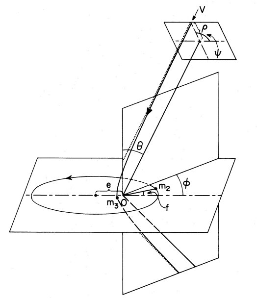

# 3 Body project data 
***

You will find the data for this project in this Drive folder : 

[Drive](https://drive.google.com/drive/folders/1CXuuwKsHnQWA9cYOaXarJpMj-fcfZxSj?usp=sharing)

This project aims to build a classifier for determining the outcome of a 3 body black hole scattering event. In the dataset you will find the initial conditions and the outcome of 2e5 simulations. If the project goes well there will be more datasets to analyze of similar simulations

The information in the dataset are divided as follows:
- **Columns 0-14** initial conditions of the simulation .
- **Columns 15-18** : Labels that indicate how the simulation ended

## Initial conditions

0) Simulation label

1) **m1** : Mass of the primary black hole of the original binary (the more massive one) in solar masses units
2) **m2** : Mass of the secondary black hole of the original binary (the least  massive one) in solar masses units

3) **m3** : Mass of the incoming single black hole black hole  in solar masses units

4) **a_pc** : Semi-major axis of the binary at the start of the simulation, in parsecs

5) **e** : Binary Eccentricity at the start of the simulation

6) **b_pc** : Impact parameter of the **m3** black hole in parsec (minimum distance of the straight line trajectory of **m3** to the center of mass of the binary)
   
7) **b_max_pc** : Auxiliary parameter that describes the maximum impact parameter for this binary in parsecs. This value is used during the simulation to sample **b** in a distribution \[0,**b_max**\]. This is a redundant parameter so you can decide whether to include it or not in the input data.

8) **phi** : Spherical angular coordinate for the initial position of **m3**   in radiandts, look at the image below.

9) **theta** :  Spherical angular coordinate for the initial position of **m3** in radiandts, look at the image below.

10) **psi**  : Spherical angular coordinate for the initial position of **m3** in radiandts, look at the image below.

 

11) **f** Phase of the binary at the start of the simulation in radiants

12) **v** Relative velocity of the single black hole w.r.t the binary in km/s 

13) **Ecc_anomaly** Auxiliary parameter used to sample the phase of the binary. The same reasoning given for **b_max** applies.

14) **t_coal** time the binary would take to coalesce due to the emission of gravitational waves without any external interactions in years. This is also technically a redundant parameter

## Outcome label
15) **OUTCOME** is the label of the outcome of the interaction after simulating the systems for (a maximum of) 1e5 years. Predicting this label will be the main focus for this project. The labels mean:

    0 = fly-by : The binary remains intact after the encounter
    
    1=  Exchange 2-3 : **m3** has kicked **m2** out of the system and now forms a binary with **m1** 

    2=  Exchange 1-3 : **m3** has kicked **m1** out of the system and now forms a binary with **m2** 

    3=  Ionization : No binary exists at the end of the simulation, **m3** has destroyed the binary. 

    
## Extra Outcome labels
Not the main focus of the project but could be added as training objectives if you complete the main project quickly

16) **MERGE** Does this binary merge?

    0 =  No

    1 =  Yes, within the 1e5 years of the simulation

    2 = Yes, within an Hubble time (13.8e9 years)

17) **2gBBH** Does the simulation lead to a 2nd generation black hole (two components merge within the simulation time and the 3rd object remains to form a new binary with the merger remanent )? 

    0 = No

    1 = Yes

18) **TRIPLE** Is the simulation still going on after 1e5 years? (meaning that the 3 bodies are still gravitationally bounded together in a 3 body interaction)

    0= No

    1=  Yes

Useful insights for what these parameters mean can be found at [ 
10.1086/160956](https://ui.adsabs.harvard.edu/abs/1983ApJ...268..319H/abstract) and [2105.12757](https://arxiv.org/abs/2105.12757)
